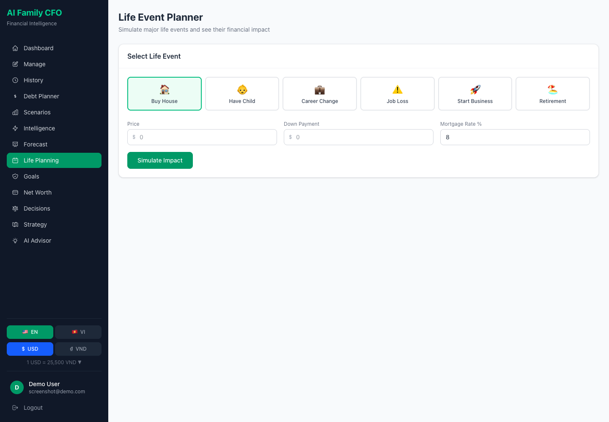
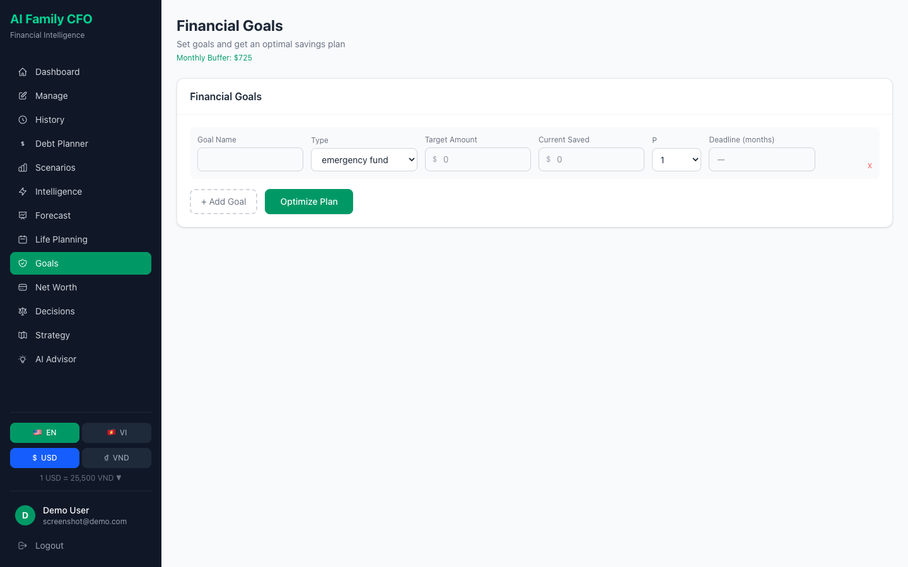
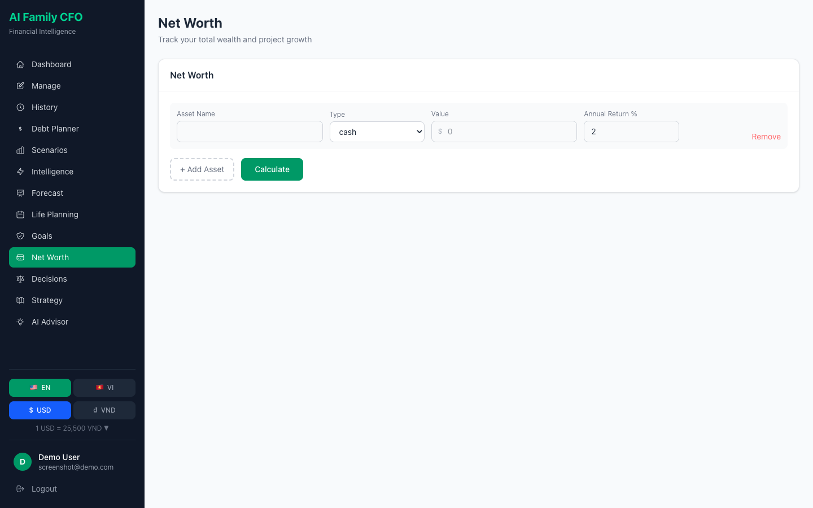
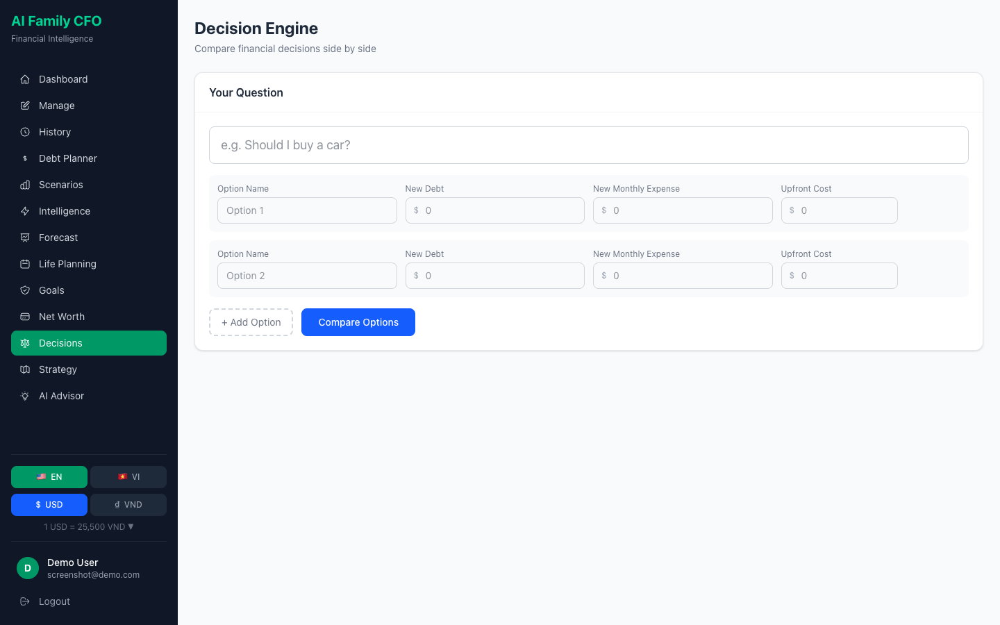
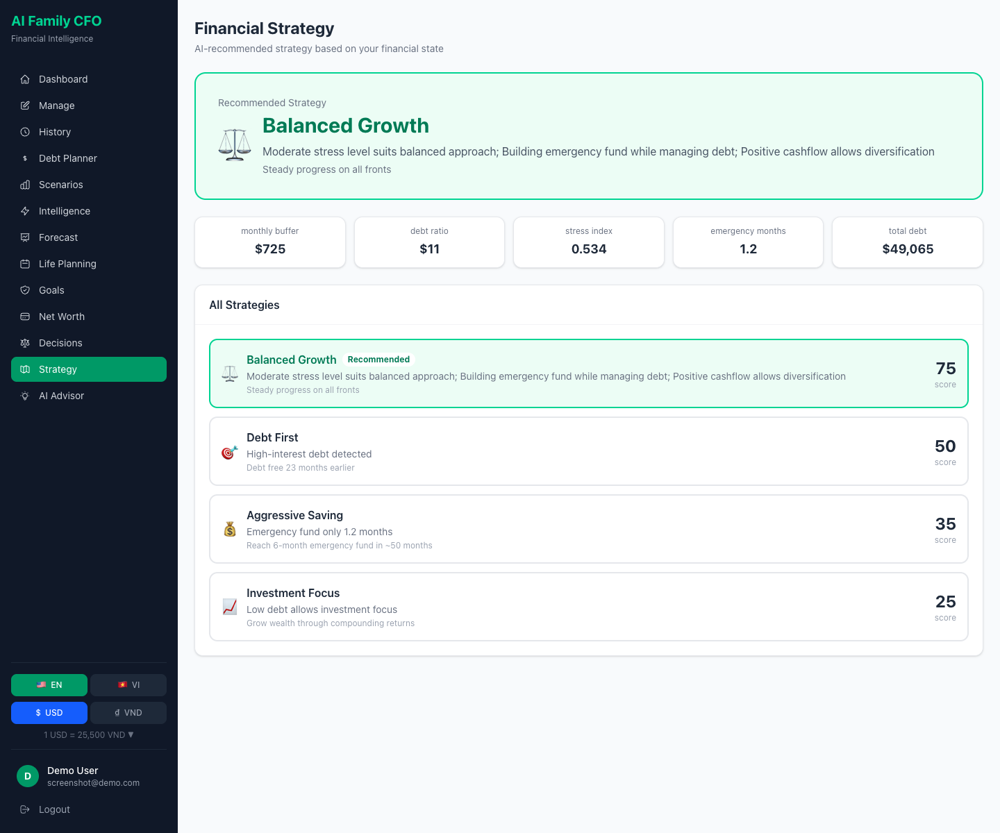
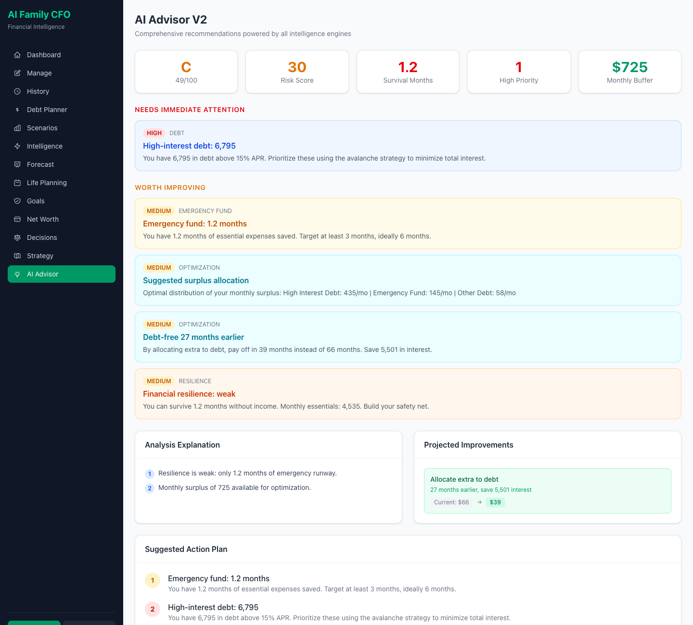
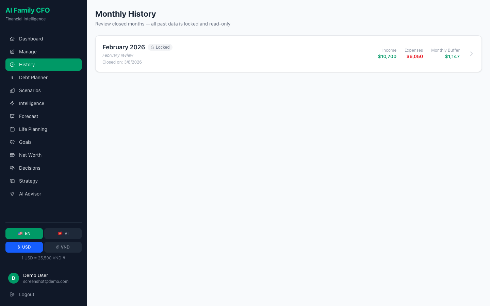
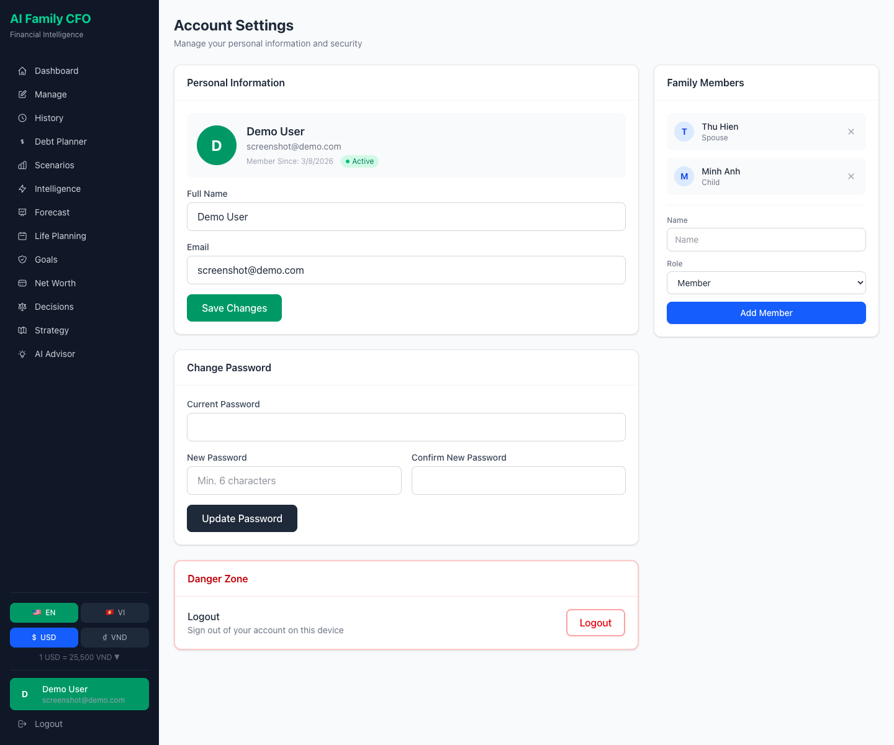
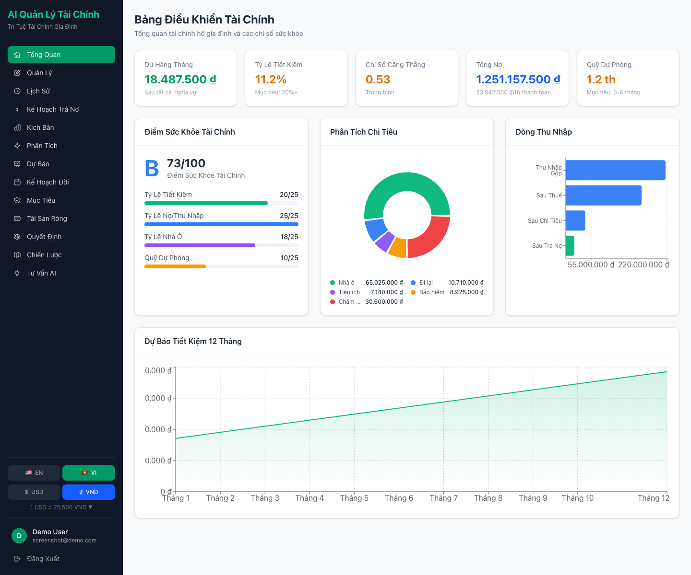

# AI Family CFO

AI-powered household financial planning platform with life event simulation, goal optimization, decision intelligence, and Monte Carlo forecasting.


## Features

### Core Financial Management
- **Dashboard** — Financial overview with health score, expense breakdown, income waterfall, stress index, 12-month projection
- **Manage Finances** — Full CRUD for income, expenses, and debts with currency-aware inputs
- **Monthly History** — Close months to create locked snapshots with automatic rollover
- **Debt Planner** — Avalanche vs Snowball strategy comparison with payoff timelines
- **Scenario Simulator** — What-if analysis: job loss, raise, new baby, emergency, expense cuts

### V2 Intelligence Layer
- **Risk Engine** — 8 risk flags including stress index and single-income dependency
- **Financial Score** — Weighted composite (debt 30%, savings 25%, resilience 25%, goals 20%)
- **Monte Carlo Simulation** — 1,000 probabilistic scenarios with savings distribution
- **Allocation Optimizer** — Optimal surplus distribution with recommended actions
- **Behavior Engine** — Overspending, lifestyle inflation, category growth detection
- **Forecast Engine** — Statistical projections from monthly history

### V3 Life Planning
- **Life Event Planner** — Simulate buying a house, having a child, career change, retirement
- **Goal Optimizer** — Set financial goals with deadlines; get optimal savings plans
- **Net Worth Tracker** — Asset portfolio with 10-year compound growth projection
- **Decision Engine** — Compare financial decisions side-by-side with risk/savings/cashflow analysis
- **Strategy Engine** — AI recommends Debt First / Balanced Growth / Aggressive Saving / Investment Focus
- **AI Memory** — Store and retrieve historical advice for personalized recommendations

### Platform
- **Authentication** — JWT with register, login, password change, family members
- **Multi-language** — English and Vietnamese (338 translated keys)
- **Multi-currency** — USD and VND with configurable exchange rate
- **Docker** — Full containerized deployment (PostgreSQL + FastAPI + Next.js)

## Screenshots

### Authentication
| Login | Register |
|-------|----------|
|  |  |

### Dashboard


### Manage Finances


### Debt Planner


### Scenario Simulator


### Financial Intelligence (V2)


### Monte Carlo Forecast (V2)


### Life Event Planner (V3)


### Financial Goals (V3)


### Net Worth Tracker (V3)


### Decision Engine (V3)


### Financial Strategy (V3)


### AI Advisor


### Monthly History


### User Profile


### Vietnamese + VND


## Tech Stack

| Layer | Technology |
|-------|-----------|
| **Frontend** | Next.js 16, TypeScript, Tailwind CSS, Recharts |
| **Backend** | FastAPI (Python 3.11), Pydantic V2 |
| **Database** | PostgreSQL 16 (JSONB) |
| **Auth** | JWT + bcrypt |
| **Container** | Docker Compose |

## Quick Start

### Docker (recommended)

```bash
git clone <repo-url>
cd ai-family-cfo-fintech
docker compose up -d
```

- **Frontend**: http://localhost:3000
- **Backend API**: http://localhost:8001
- **API Docs**: http://localhost:8001/docs
- **PostgreSQL**: localhost:5434

### Local Development

```bash
# Backend
cd backend
pip install -r requirements.txt
uvicorn main:app --port 8001 --reload

# Frontend
cd frontend
npm install
npm run dev
```

## API Endpoints

### V1 — Core Financial
| Endpoint | Description |
|----------|-------------|
| `POST /api/v1/simulate` | Cashflow analysis with stress index |
| `POST /api/v1/simulate/project` | 12-month projections |
| `POST /api/v1/debt/optimize` | Debt payoff schedule |
| `POST /api/v1/debt/compare` | Avalanche vs Snowball |
| `POST /api/v1/scenario/compare` | What-if scenarios |
| `POST /api/v1/scenario/stress-test` | Stress testing |

### V2 — Intelligence
| Endpoint | Description |
|----------|-------------|
| `POST /api/v2/financial-risk` | Risk assessment with 8 flags |
| `POST /api/v2/financial-resilience` | Survival months analysis |
| `POST /api/v2/financial-score` | Weighted health score (30/25/25/20) |
| `POST /api/v2/monte-carlo` | Monte Carlo simulation |
| `POST /api/v2/optimize-allocation` | Surplus optimization |
| `POST /api/v2/timelines` | 5-year financial timelines |
| `POST /api/v2/recommendations` | AI recommendations |
| `GET /api/v2/financial-forecast` | Forecast from history (auth) |
| `GET /api/v2/financial-behavior` | Behavior analysis (auth) |

### V3 — Life Planning
| Endpoint | Description |
|----------|-------------|
| `POST /api/v3/life-event` | Simulate life event impact |
| `POST /api/v3/goals/optimize` | Optimize savings across goals |
| `POST /api/v3/net-worth` | Net worth + 10yr projection |
| `POST /api/v3/decision` | Compare financial decisions |
| `POST /api/v3/strategy` | AI strategy recommendation |
| `POST /api/v3/memory` | Store AI memory (auth) |
| `GET /api/v3/memory` | Retrieve memories (auth) |

### Auth & User
| Endpoint | Description |
|----------|-------------|
| `POST /api/v1/auth/register` | Create account |
| `POST /api/v1/auth/login` | Sign in |
| `GET /api/v1/user/me` | Get user info |
| `PATCH /api/v1/user/me` | Update user |
| `GET/PUT /api/v1/user/profile` | Financial data |
| `GET/POST/DELETE /api/v1/user/family` | Family members |
| `GET/POST /api/v1/user/snapshots` | Monthly history |

## Architecture

```
frontend/                 Next.js 16 + TypeScript + Tailwind
  src/app/                17 pages (routes)
  src/components/         Shared UI (Card, MetricCard, MoneyInput, etc.)
  src/lib/                API clients (v1, v2, v3), contexts, i18n (EN/VI)

backend/                  FastAPI + Python 3.11
  simulation/             V1: cashflow, debt, scenario, timeline engines
  intelligence/           V2: risk, forecast, behavior, resilience, score
  probabilistic/          V2: Monte Carlo simulation
  optimization/           V2: allocation optimizer
  advisor/                V1 rules + V2 recommendation engine
  life_planning/          V3: life event engine
  goals/                  V3: goal optimizer
  assets/                 V3: net worth engine
  decision/               V3: decision engine
  strategy/               V3: strategy engine
  memory/                 V3: AI memory
  auth/                   JWT auth + user routes
  db/                     PostgreSQL schema
  models/                 Pydantic models (financial, user, v3)
  routes.py               V1 API
  routes_v2.py            V2 API
  routes_v3.py            V3 API

docker-compose.yml        3 services: db + backend + frontend
```

## Environment Variables

| Variable | Service | Default |
|----------|---------|---------|
| `DATABASE_URL` | Backend | `postgresql://cfo_user:...@db:5432/family_cfo` |
| `JWT_SECRET` | Backend | Set in `.env` |
| `CORS_ORIGINS` | Backend | `http://localhost:3000,...` |
| `NEXT_PUBLIC_API_URL` | Frontend | `http://localhost:8001` |

## License

MIT
