# AI Family CFO

AI-powered household financial planning and management system. Track income, expenses, and debts. Get intelligent recommendations, run Monte Carlo simulations, and optimize your financial strategy.

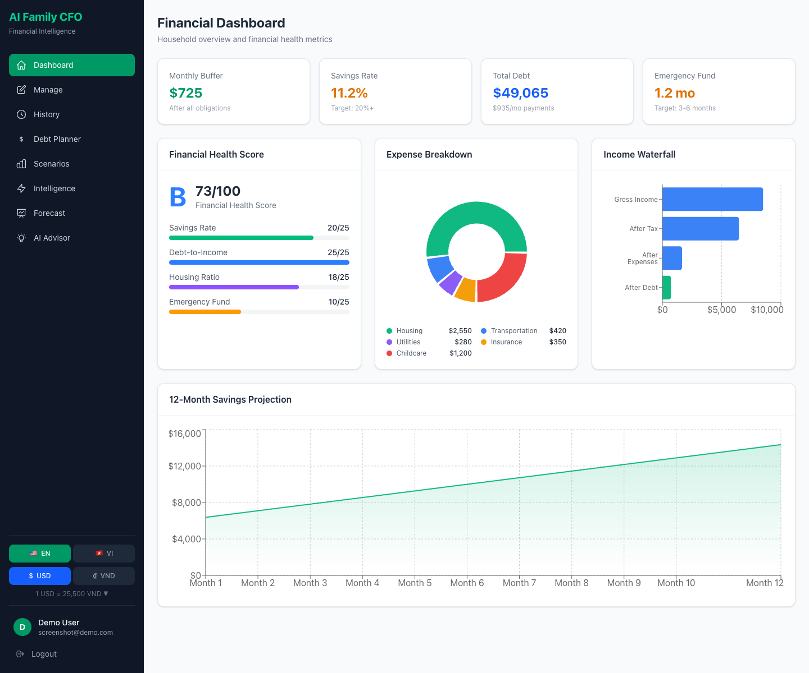

## Features

### Core Financial Management
- **Dashboard** — Real-time financial overview with health score, expense breakdown, income waterfall, and 12-month savings projection
- **Manage Finances** — Full CRUD for income sources, expenses, and debts with currency-aware inputs
- **Monthly History** — Close months to create locked snapshots. Fixed items carry over, variable items clear, debt balances auto-reduce
- **Debt Planner** — Avalanche vs Snowball strategy comparison with payoff timelines
- **Scenario Simulator** — What-if analysis: job loss, raise, new baby, emergency, expense cuts

### V2 Intelligence Layer
- **Risk Engine** — Detects 7 risk flags (high debt ratio, low emergency fund, negative cashflow, etc.)
- **Resilience Engine** — Calculates months of survival without income
- **Financial Score** — Weighted composite score: debt ratio + savings rate + resilience + goal progress
- **Monte Carlo Simulation** — 1,000 probabilistic scenarios for savings and debt-free projections
- **Allocation Optimizer** — Optimal surplus distribution between debt, savings, and emergency fund
- **Behavior Engine** — Detects overspending, lifestyle inflation, and category growth patterns
- **Forecast Engine** — Statistical projections from monthly history
- **AI Advisor V2** — Comprehensive recommendations integrating all intelligence engines

### Platform Features
- **Authentication** — JWT-based auth with register, login, password change
- **User Profiles** — Family member management, personal settings
- **Multi-language** — English and Vietnamese (256 translated keys)
- **Multi-currency** — USD and VND with configurable exchange rate
- **Docker** — Full containerized deployment (PostgreSQL + FastAPI + Next.js)

## Screenshots

### Authentication
| Login | Register |
|-------|----------|
| 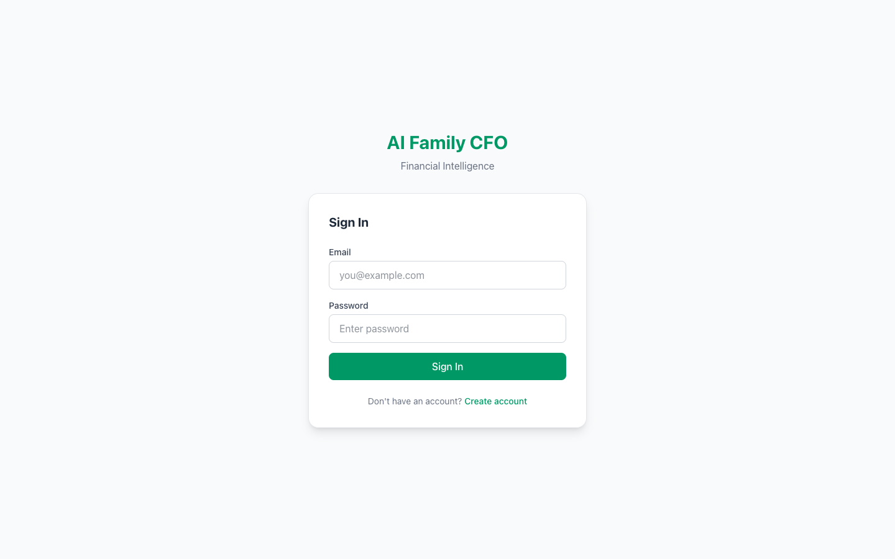 | 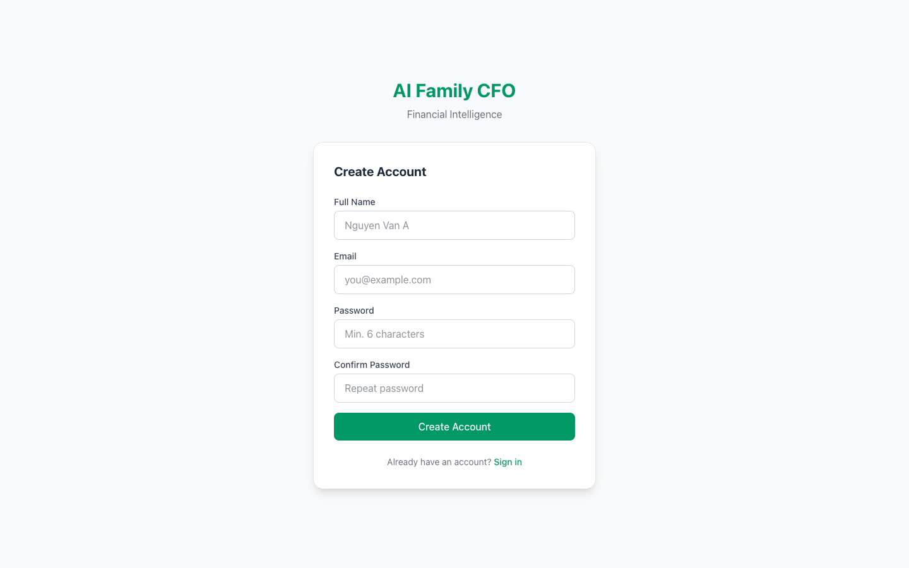 |

### Financial Dashboard


### Manage Finances
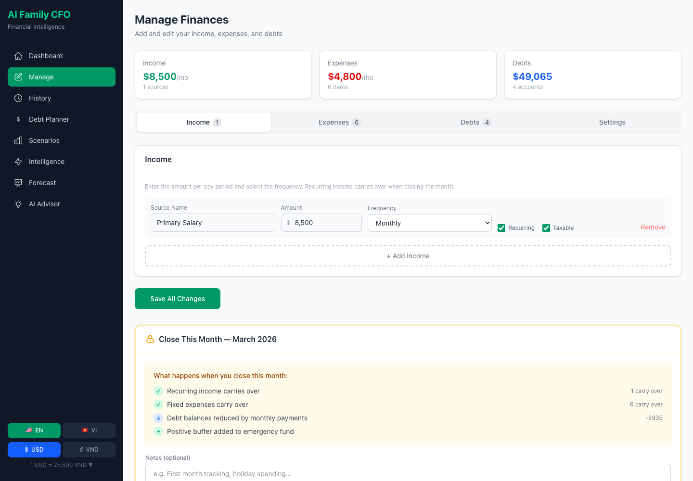

### Debt Planner
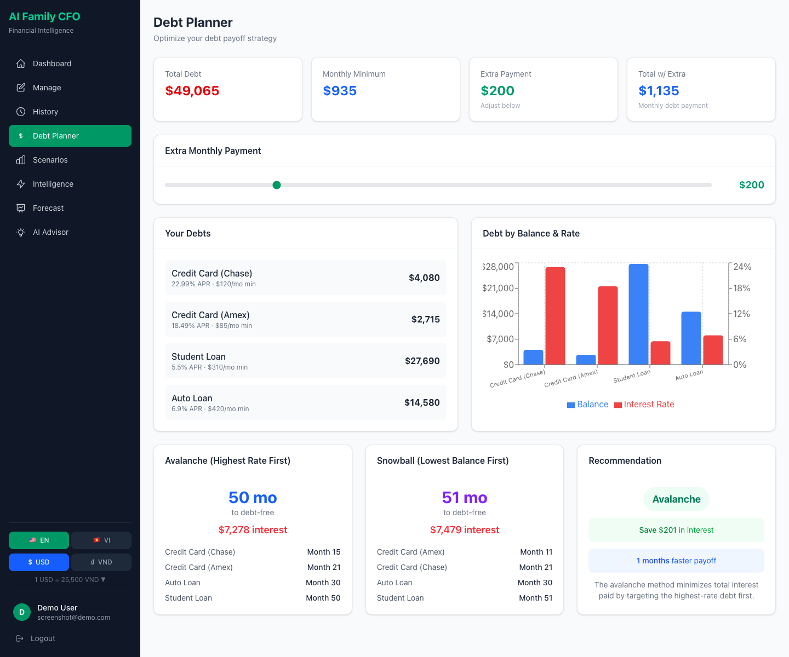

### Scenario Simulator
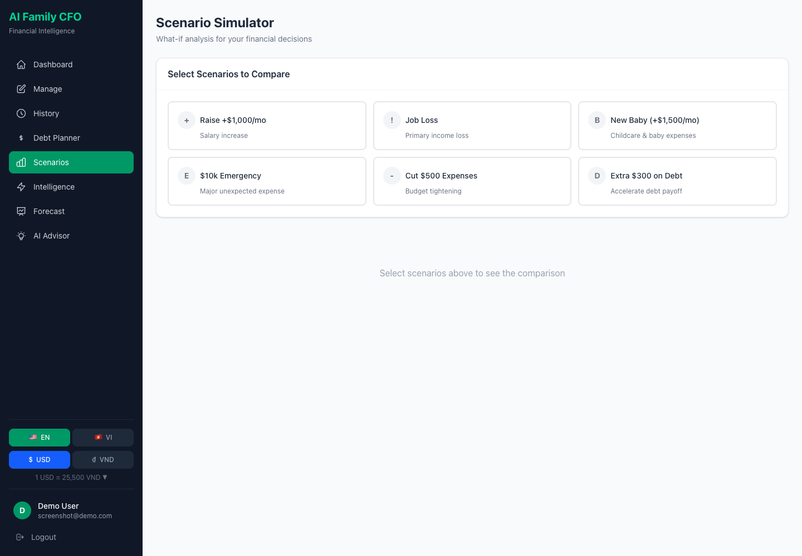

### Financial Intelligence (V2)
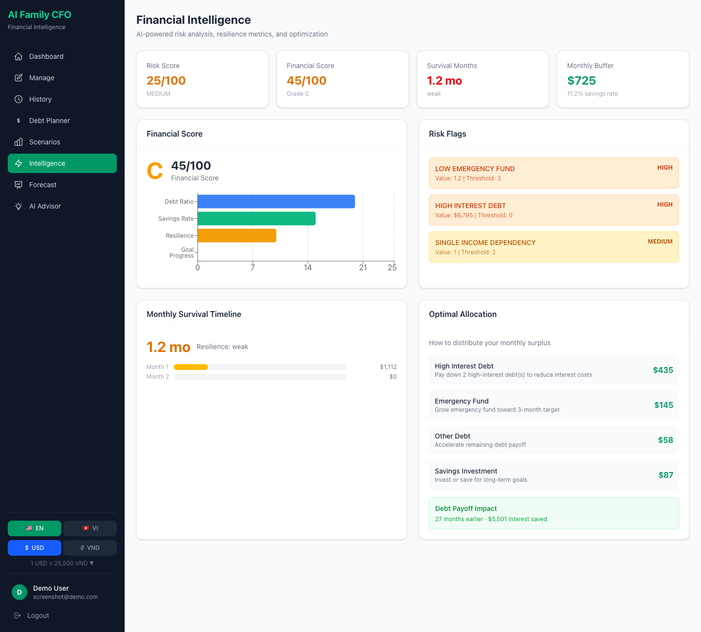

### Monte Carlo Forecast (V2)
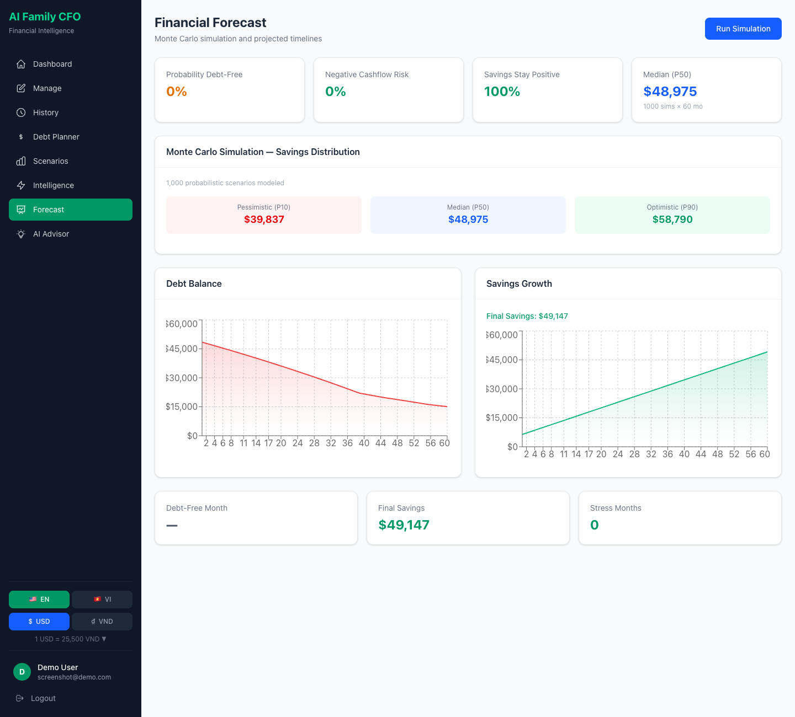

### AI Advisor V2
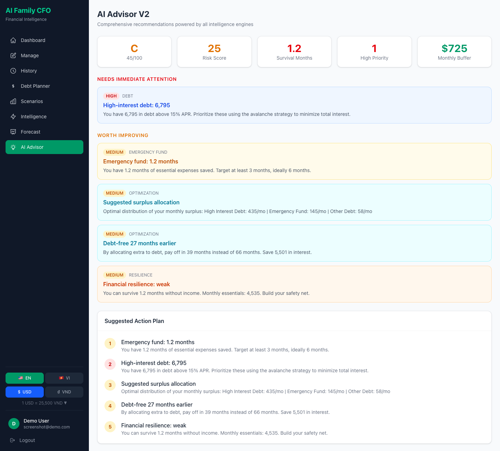

### Monthly History
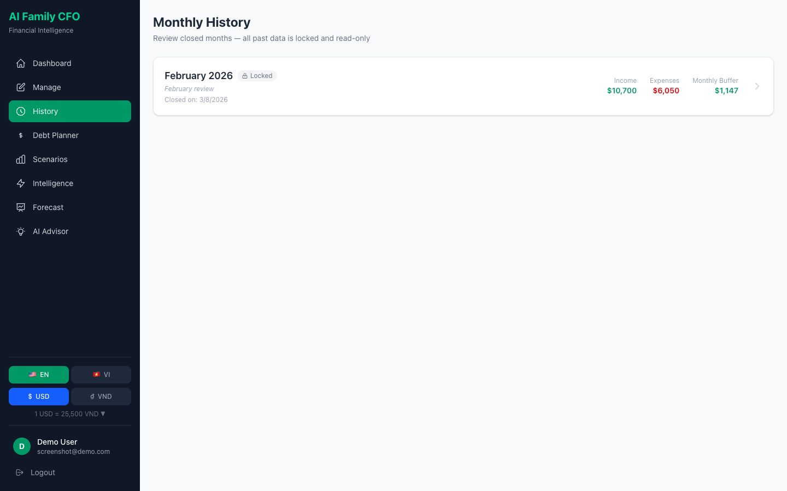

### User Profile
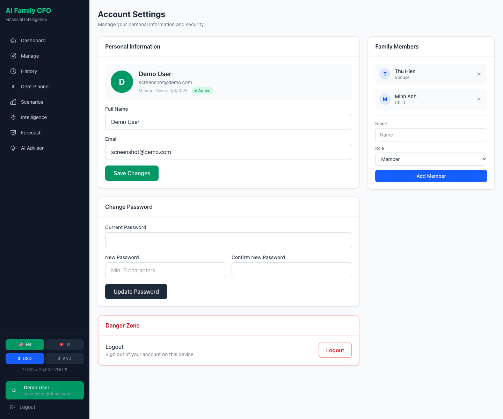

### Vietnamese + VND
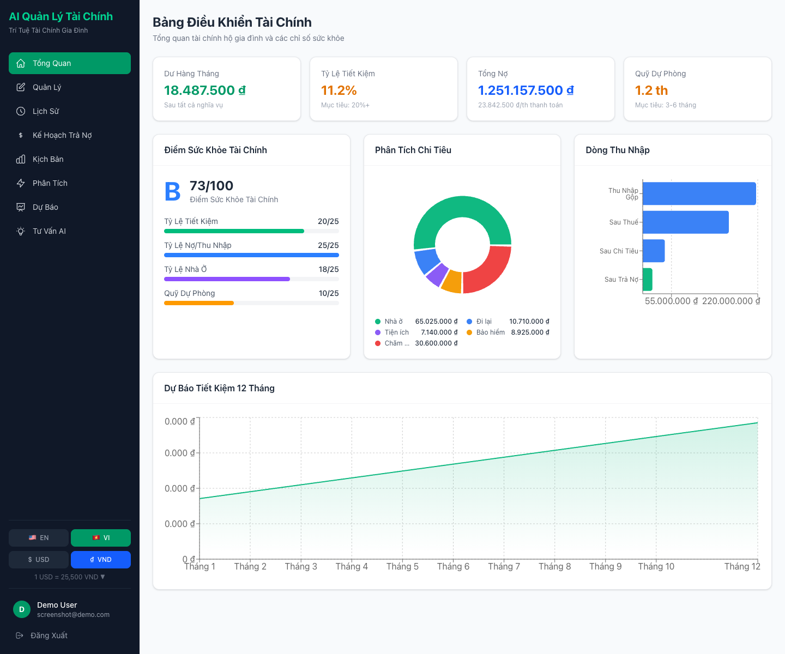

## Tech Stack

| Layer | Technology |
|-------|-----------|
| **Frontend** | Next.js 16, TypeScript, Tailwind CSS, Recharts |
| **Backend** | FastAPI (Python), Pydantic V2 |
| **Database** | PostgreSQL 16 (JSONB) |
| **Auth** | JWT + bcrypt |
| **Container** | Docker Compose |

## Quick Start

### Docker (recommended)

```bash
git clone <repo-url>
cd ai-family-cfo-fintech

# Start all services
docker compose up -d

# Open in browser
open http://localhost:3000
```

Services:
- **Frontend**: http://localhost:3000
- **Backend API**: http://localhost:8001
- **API Docs**: http://localhost:8001/docs
- **PostgreSQL**: localhost:5434

### Local Development

```bash
# Backend
cd backend
pip install -r requirements.txt
uvicorn main:app --port 8001 --reload

# Frontend
cd frontend
npm install
npm run dev
```

## API Endpoints

### V1 — Core Financial (POST, accept HouseholdProfile body)
| Endpoint | Description |
|----------|-------------|
| `POST /api/v1/simulate` | Cashflow analysis |
| `POST /api/v1/simulate/project` | 12-month projections |
| `POST /api/v1/debt/optimize` | Debt payoff schedule |
| `POST /api/v1/debt/compare` | Avalanche vs Snowball |
| `POST /api/v1/scenario/compare` | What-if scenarios |
| `POST /api/v1/scenario/stress-test` | Stress testing |
| `POST /api/v1/advisor/recommendations` | V1 recommendations |

### V2 — Intelligence Layer
| Endpoint | Description |
|----------|-------------|
| `POST /api/v2/financial-risk` | Risk assessment with flags |
| `POST /api/v2/financial-resilience` | Survival months analysis |
| `POST /api/v2/financial-score` | Weighted health score |
| `POST /api/v2/monte-carlo` | Monte Carlo simulation |
| `POST /api/v2/optimize-allocation` | Surplus allocation |
| `POST /api/v2/timelines` | 5-year financial timelines |
| `POST /api/v2/recommendations` | AI recommendations (full) |
| `GET /api/v2/financial-forecast` | Forecast from history (auth) |
| `GET /api/v2/financial-behavior` | Behavior analysis (auth) |

### Auth & User
| Endpoint | Description |
|----------|-------------|
| `POST /api/v1/auth/register` | Create account |
| `POST /api/v1/auth/login` | Sign in |
| `GET /api/v1/user/me` | Get user info |
| `PATCH /api/v1/user/me` | Update user |
| `GET/PUT /api/v1/user/profile` | Financial data |
| `GET/POST/DELETE /api/v1/user/family` | Family members |
| `GET/POST /api/v1/user/snapshots` | Monthly history |

## Architecture

```
frontend/           Next.js 16 + TypeScript + Tailwind
  src/
    app/            Pages (12 routes)
    components/     Shared UI components
    lib/            API clients, contexts, i18n (EN/VI)

backend/            FastAPI + Python 3.11
  simulation/       V1 core engines (cashflow, debt, scenario, timeline)
  intelligence/     V2 risk, forecast, behavior, resilience, score
  probabilistic/    V2 Monte Carlo simulation
  optimization/     V2 allocation optimizer
  advisor/          V1 rules engine + V2 recommendation engine
  auth/             JWT auth + user routes
  db/               PostgreSQL connection + schema
  models/           Pydantic models

docker-compose.yml  3 services: db + backend + frontend
```

## Environment Variables

| Variable | Service | Default |
|----------|---------|---------|
| `DATABASE_URL` | Backend | `postgresql://cfo_user:...@db:5432/family_cfo` |
| `JWT_SECRET` | Backend | Set in `.env` |
| `CORS_ORIGINS` | Backend | `http://localhost:3000,...` |
| `NEXT_PUBLIC_API_URL` | Frontend | `http://localhost:8001` |

## License

MIT
